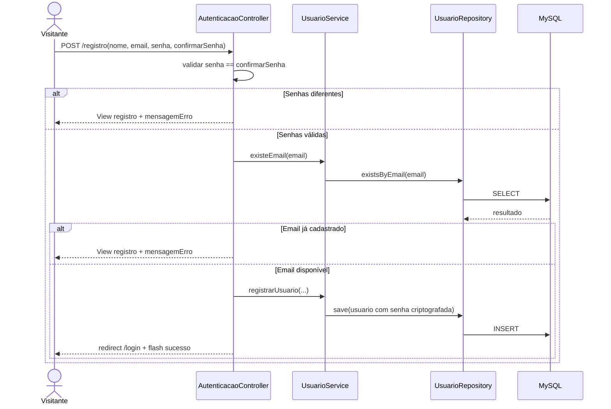
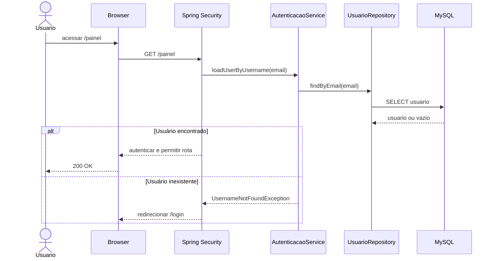
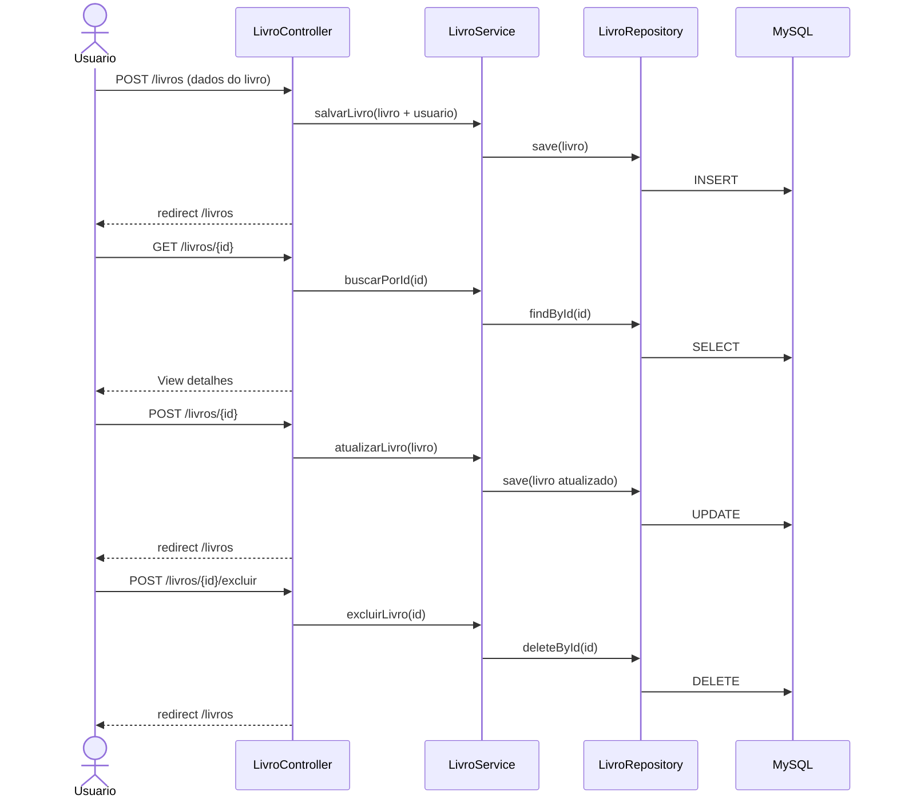
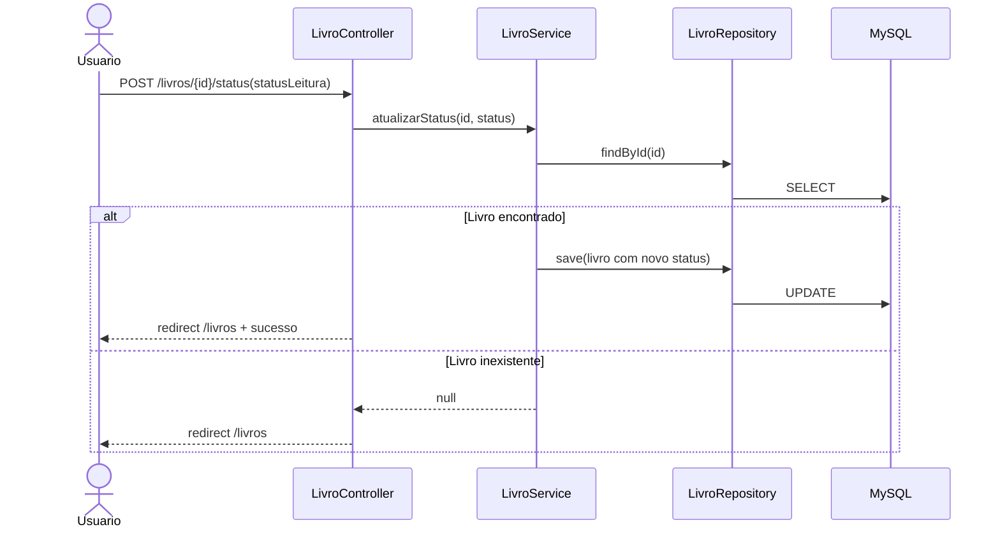
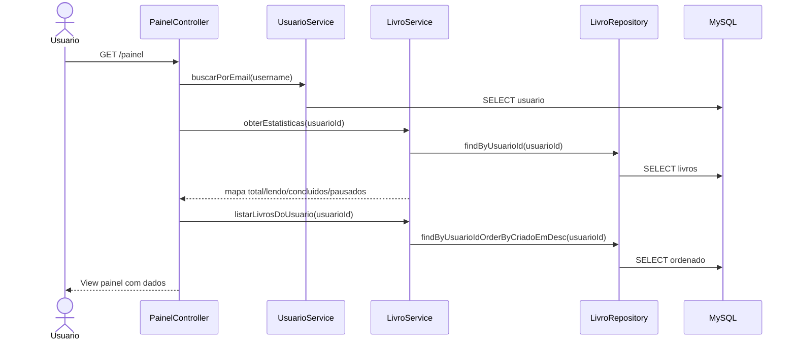
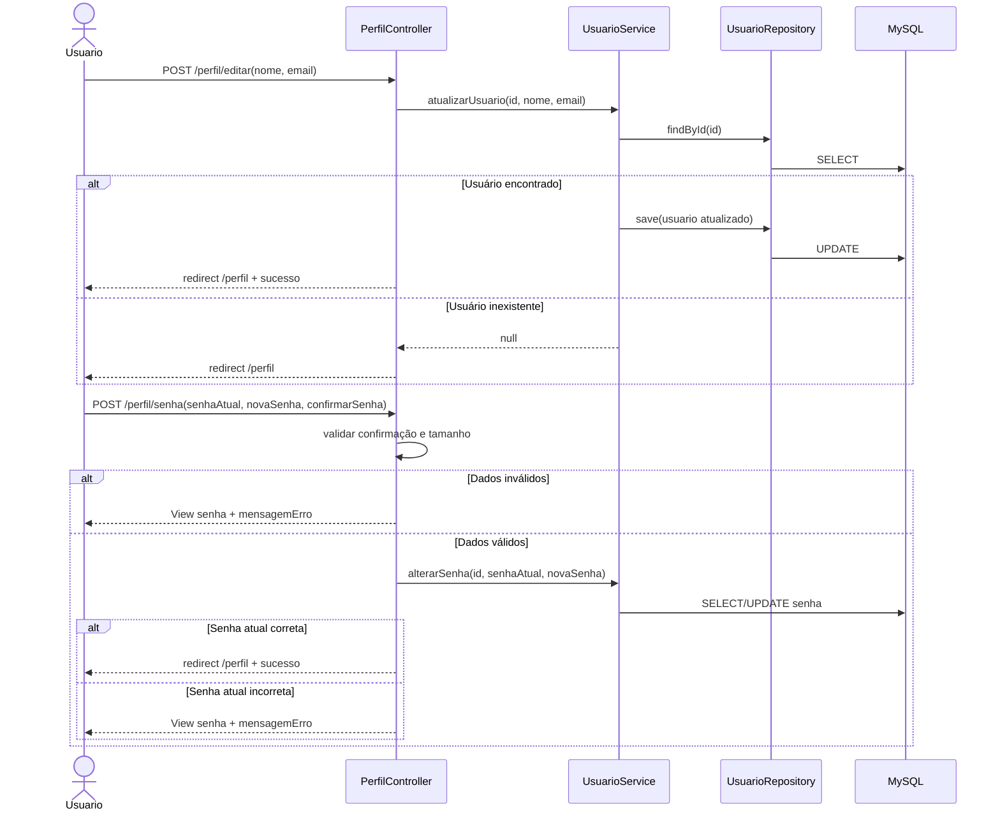
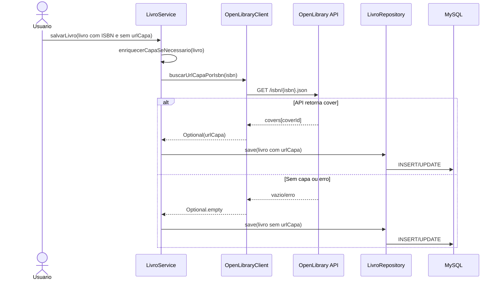
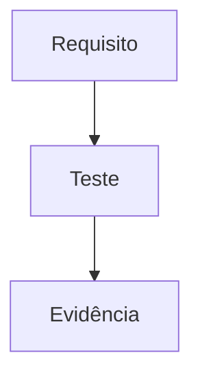

# Matriz de Rastreabilidade de Requisitos (RTM)

Projeto: Gerenciador de Biblioteca Pessoal  
Versão: 1.1  
Data: 12 de Abril de 2026  

---

## 1. Objetivo

Mapear cada requisito funcional para implementação e testes automatizados, mantendo rastreabilidade ponta a ponta e cobertura funcional completa.

---

## 2. Requisitos Funcionais

| ID | Nome | Descrição |
|:---|:---|:---|
| RF-001 | Cadastro de usuário | Permitir registro com validação de senha e prevenção de email duplicado. |
| RF-002 | Autenticação e acesso | Exibir login, exigir autenticação nas áreas protegidas e carregar usuário autenticado. |
| RF-003 | CRUD de livros | Permitir criar, listar, visualizar, editar e excluir livros do usuário autenticado. |
| RF-004 | Status de leitura | Permitir alterar status (Não Iniciado, Lendo, Concluído, Pausado). |
| RF-005 | Painel com estatísticas | Exibir visão consolidada do usuário e métricas de leitura. |
| RF-006 | Gestão de perfil | Permitir visualizar/editar perfil e alterar senha com validações. |
| RF-007 | Capa automática por ISBN | Buscar capa na Open Library quando ISBN existir e URL de capa estiver vazia. |

---

## 3. Matriz de Rastreabilidade

| ID | Componentes de Código Relacionados | Casos de Teste Relacionados | Tipo de Teste | Evidência | Status |
|:---|:---|:---|:---|:---|:---|
| RF-001 | AutenticacaoController, UsuarioService | AutenticacaoControllerTest.testRegistroComSucesso, testRegistroSenhasDiferentes, testRegistroEmailDuplicado, UsuarioServiceTest.testRegistrarUsuario, testRegistrarEmailDuplicado | Integração + Caixa Branca | Fluxo de cadastro e validações exercitados | Coberto |
| RF-002 | AutenticacaoController, AutenticacaoService, ConfigSecurity | AutenticacaoControllerTest.testPaginaInicial, testPaginaLogin, LivroControllerTest.testAcessoSemLogin, PainelControllerTest.testPainelSemLogin, AutenticacaoServiceTest.testCarregarUsuarioExistente, testCarregarUsuarioInexistente | Integração + Segurança | Acesso protegido e carregamento de usuário validados | Coberto |
| RF-003 | LivroController, LivroService, LivroRepository | LivroControllerTest.testListarLivros, testFormularioNovoLivro, testSalvarLivro, testVerLivro, testFormularioEditar, testAtualizarLivro, testExcluirLivro, LivroServiceTest.testSalvarLivro, testBuscarPorId, testListarLivros, testAtualizarLivro, testExcluirLivro | Caixa Preta + Caixa Branca | CRUD completo exercitado em controller e service | Coberto |
| RF-004 | LivroController, LivroService | LivroControllerTest.testMudarStatus, LivroServiceTest.testAtualizarStatus, testAtualizarStatusInexistente, LivroTest.testNomeExibicaoDoStatus, testTodosStatusTemNome | Integração + Parametrizado | Atualização e enum de status validados | Coberto |
| RF-005 | PainelController, LivroService, UsuarioService | PainelControllerTest.testPainelComLogin, LivroServiceTest.testEstatisticas | Integração + Caixa Branca | Estatísticas e dados do painel validados | Coberto |
| RF-006 | PerfilController, UsuarioService | PerfilControllerTest.testVerPerfil, testFormularioEditarPerfil, testAtualizarPerfil, testFormularioAlterarSenha, testAlterarSenha, testAlterarSenhaDiferente, testAlterarSenhaAtualErrada, testAlterarSenhaCurta, UsuarioServiceTest.testAtualizarUsuario, testAlterarSenha, testAlterarSenhaErrada | Caixa Preta + Caixa Branca | Fluxos de perfil e senha validados com cenários de erro | Coberto |
| RF-007 | LivroService, OpenLibraryClient | OpenLibraryClientTest.deveBuscarUrlDaCapaDaOpenLibrary, deveRetornarVazioQuandoApiNaoInformarCapa, LivroServiceTest.testSalvarLivro, testAtualizarLivro | Integração + Caixa Branca | Enriquecimento por ISBN e fallback sem capa validados | Coberto |

Resumo de cobertura funcional: 7 de 7 requisitos cobertos (100%).

---

## 4. Diagramas UML de Sequência por Requisito

### RF-001 - Cadastro de usuário



### RF-002 - Autenticação e acesso



### RF-003 - CRUD de livros



### RF-004 - Status de leitura



### RF-005 - Painel com estatísticas



### RF-006 - Gestão de perfil



### RF-007 - Capa automática por ISBN



---

## 5. Visualização dos Diagramas no VS Code (Mermaid)

Este documento usa blocos Mermaid no formato fenced code block para compatibilidade com a extensão de preview.

Exemplo (padrão usado neste RTM):



Exemplo com ícones (Iconify):

```mermaid
architecture-beta
    service usuario(mdi:account)
    service api(logos:spring-icon)
    service banco(logos:mysql)

    usuario:R --> L:api
    api:R --> L:banco
```



Configuração recomendada no VS Code:

```json
{
  "markdown-mermaid.mouseNavigation.enabled": "alt",
  "markdown-mermaid.controls.show": "onHoverOrFocus",
  "markdown-mermaid.resizable": true,
  "markdown-mermaid.maxHeight": "80vh"
}
```

---

## 6. Checklist de Conformidade

- [x] Todos os requisitos funcionais do projeto atual foram mapeados.
- [x] Cada requisito possui diagrama UML de sequência em Mermaid.
- [x] Cada requisito possui rastreio para testes automatizados existentes.
- [x] Cobertura funcional consolidada em 100% (7/7 RFs cobertos).